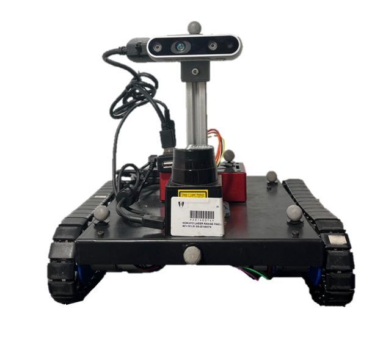

# Traxter Software Repository
This is a repository for TIR-ANT's (**T**racked **I**nspired **R**obot **A**utonomous **N**avigation **T**ool) source-code.

The TIR-ANT is a tracked mobile robot with Simultaneous Localisation and Mapping (SLAM) capabilities. It is a Ubuntu Jammy, ROS2-Humble based robot. The robots main hardware specifications are:
- Raspberry Pi 4B 8GB
- Adafruit BNO055 absolute orientation IMU
- Intel RealSense D435
- Hokuyo URG-04LX-UG01 2D laser rangefinder
- ESP32 DevKit-C

&nbsp;

&nbsp;  

The name of the repository is an homage to the donor robot who donated its locomotion apparatus so that the TIR-ANT could be built, the Traxter robot.

This work was developed by Francisco Gonçalves to obtain the Master of Science Degree in Mechanical Engineering at Instituto Superior Técnico of Universidade de Lisboa.

Licence: **TO BE DETERMINED**

## Branches

This repository contains four branches:
- The ```tirant``` branches are the ones compatible with the robot itself and can run on it.
- The ```workstation``` branches are the ones that should run on the user's workstation. The main difference between these branches and the ```tirant``` ones is the inclusion of the gazebo-based simulation packages which are not compatible with the Raspberry Pi 4B's chip architecture.
- The branches with ```-stable``` in their name are branches which only thoroughly tested code can be pushed to.
- The ```-dev``` branches are for code testing and prototyping.

## Installation

These packages should be downloaded to a ROS2 Humble workspace in a ```src``` folder. The necessary dependencies should be installed by running the following command on the workspace's root directory:  
```rosdep install --from-paths src -y --ignore-src```  

However, managing dependencies is usually not as simple as running one single command. For sanity's sake, I listed all the packages installed on the TIR-ANT in [here](Installation.md).

## Media

Videos of the TIR-ANT working are made available on [TIR-ANT's Youtube channel](https://www.youtube.com/channel/UCXVvlVw6OO0v1a0kCItt89w).

The dissertation of the project is available at: _TO BE DETERMINED_

The extended abstract is available at: _TO BE DETERMINED_

